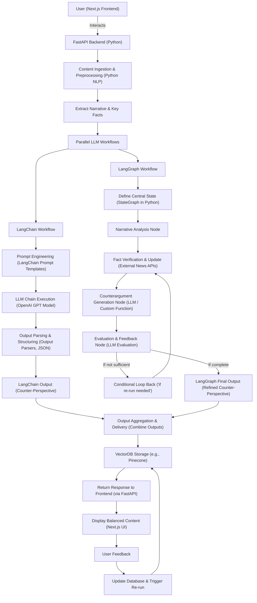
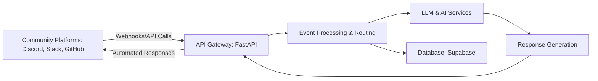
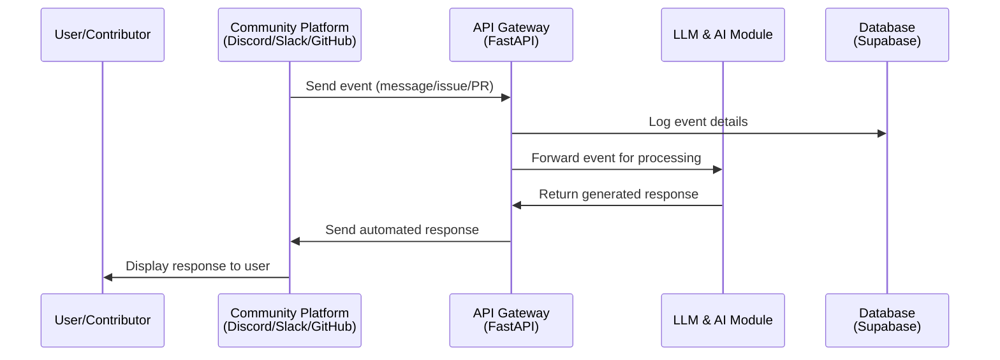

# Devr.AI Backend Planning

Devr.AI is an AI-powered Developer Relations assistant that helps maintainers and contributors interact seamlessly across platforms like Discord, Slack, and GitHub. The goal is to automate engagement, triage issues, assist with PRs, manage FAQs, and generate community analytics—all while reducing the repetitive workload of maintainers.

---

## 1. Overall System Architecture

The system is divided into several key components:

- **Integration Layer:** Connects with external platforms (Discord, Slack, GitHub, etc.) using webhooks and APIs.
- **API Gateway (FastAPI):** Serves as the central hub for incoming requests. It processes events and routes them to appropriate services.
- **AI & LLM Module:** Uses generative AI to interpret messages, answer FAQs, and generate context-aware responses.
- **Database (Supabase):** Stores all data including community interactions, metrics, and logs.
- **Workflow Automation:** Manages automated tasks like contributor onboarding, issue triage, and analytics generation.

### Architecture Diagram

---

## 2. Detailed Backend Workflow

### a. Event Handling

1. **Incoming Event:**  
   When a new event (like a message, issue, or PR) is received from a community platform, it hits the FastAPI endpoint.
   
2. **Routing:**  
   The FastAPI server analyzes the event type and routes it accordingly:
   - **Contributor Onboarding:** Automated welcome messages and guidance.
   - **Issue Triage & PR Assistance:** Prioritizes issues, offers suggestions, or links relevant docs.
   - **FAQ Requests:** Queries are forwarded to the LLM for context-aware responses.
   - **Analytics:** Engagement data is logged for later analysis.

### b. AI-Driven Processing

- **LLM Interaction:**  
  The AI module (powered by an LLM) processes the event context, retrieves relevant information from the database if necessary, and generates a tailored response.
  
- **Workflow Automation:**  
  Automated scripts and logic help in tasks like scheduling follow-ups, triggering reminders, or updating community stats.

### c. Data Persistence

- **Supabase Database:**  
  Every interaction, response, and event is logged in Supabase. This ensures:
  - Consistency in tracking contributor activities.
  - Availability of data for real-time analytics.
  - Historical data for improving AI responses.

### d. Outgoing Communication

- **Response Dispatch:**  
  Once the AI module has generated a response, it is sent back via FastAPI, which then dispatches it to the corresponding platform (e.g., a welcome message in Discord or a comment on a GitHub issue).

### Sequence Diagram

*Explanation:*  
- **Step 1:** The platform sends an event to our API Gateway.
- **Step 2:** The event is logged for analytics and future reference.
- **Step 3:** The API Gateway forwards the event to the AI module.
- **Step 4:** The AI processes the event and sends back a response.
- **Step 5:** The API Gateway then relays the response back to the originating platform.
- **Step 6:** The user sees the automated, context-aware response.

---

## 3. Key Functions of the Project

### a. AI-Driven Contributor Engagement
- **Automated Interactions:**  
  New contributors receive a warm welcome and onboarding guidance without manual intervention.
- **Smart Responses:**  
  The LLM provides context-aware answers to common questions, reducing the need for constant moderator oversight.

### b. Automated Issue Triage & PR Assistance
- **Prioritization:**  
  Issues are automatically categorized based on urgency and impact.
- **Guidance:**  
  Contributors receive actionable suggestions or are directed to relevant documentation for resolving issues.

### c. Knowledge Base & FAQ Automation
- **Instant Answers:**  
  Frequent queries are handled swiftly by the AI, pulling information from an updated knowledge base.
- **Dynamic Updates:**  
  The knowledge base can evolve with community contributions, ensuring responses remain relevant.

### d. AI-Powered Community Analytics
- **Engagement Metrics:**  
  Continuous tracking of user interactions helps in identifying active contributors and monitoring overall community health.
- **Insight Generation:**  
  Data-driven insights can help maintainers understand community trends and improve engagement strategies.

---

## 4. My Thoughts

Honestly, Parag, this project is super exciting because it combines the best of modern AI with real-world community engagement. The use of FastAPI, Supabase, and generative AI is a sweet mix that can really streamline developer relations. If built well, it could save maintainers tons of time and make community management feel almost effortless. I’d say investing in robust AI models and ensuring seamless integration across platforms will be key to its success.

